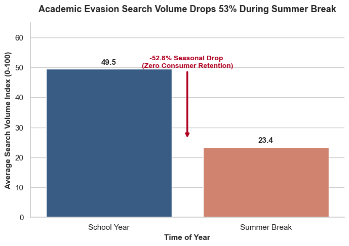
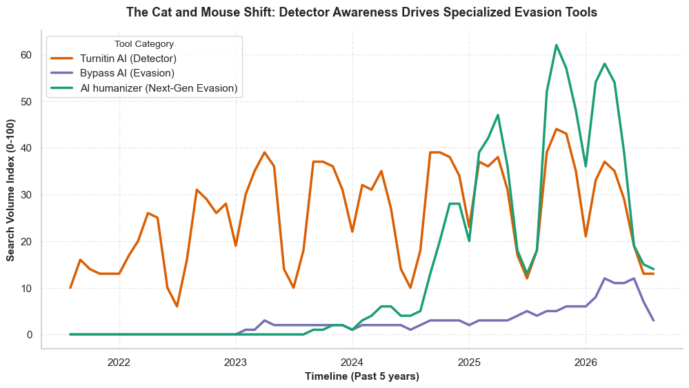
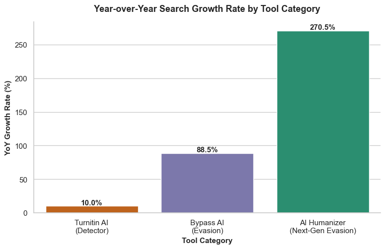

# 📊 Academic AI Search Trends: Data Analysis Project

An exploratory data analysis of 5 years of US Google Trends data examining search patterns around AI detection software and AI evasion tools.

## 🔎 Project Overview

This project looks at how public search behavior for AI tools changes over time. By analyzing search trends from 2021 to 2026, the analysis tracks seasonal search patterns and shows how user interest shifted from simple rephrasing tools to specialized "AI humanizers."

## 🛠️ Tools Used

* **Python** (Pandas, NumPy) for data cleaning and aggregation
* **Matplotlib & Seaborn** for data visualization
* **Jupyter Notebook** for data analysis

## 🏷️ Tool Definitions

To analyze search trends, tools were grouped into three distinct categories:

* **Detectors (`Turnitin_AI`):** Searches for software used to check if text was written by AI.
* **Traditional Evasion (`Bypass_AI`):** Searches for basic rephrasing keywords and early bypass tools.
* **Next-Gen Evasion (`AI_Humanizer`):** Searches for advanced tools designed to rewrite AI text to sound human and bypass detection algorithms.

---

## 📈 Key Insights

### 1. The 52.8% Summer Drop (Seasonality)

Average search volume for AI evasion keywords drops by **52.8%** every summer (June through August). Search interest peaks during active school months (October/November and April/May) and collapses as soon as school ends.

---

### 2. The Cat-and-Mouse Search Trend

Tracking multi-year search patterns shows a shift in search intent. Searches for the detector (Turnitin AI) have stayed consistently high since 2021. But starting around 2023-2024, searches for AI Humanizers — a newer, more advanced evasion tool — start climbing fast, eventually passing every other category. This suggests that as detection software became common, students moved toward tools built specifically to beat it.

---

### 3. Year-over-Year (YoY) Growth of "Humanizers"

Calculating year-over-year growth (using full calendar years only) shows a clear order of growth:

* **Turnitin AI (Detector):** +10.0%
* **Bypass AI (Traditional Evasion):** +88.5%
* **AI Humanizer (Next-Gen Evasion):** +270.5%

All three categories are growing, but AI Humanizer searches are growing by far the fastest — nearly 3x its search volume in one year.

---

## 📝 Summary of Findings

* **School Calendar Drives Demand:** The 52.8% drop during summer break shows search traffic is tied closely to active class schedules.
* **Shift Toward Specialized Tools:** All evasion-related searches are growing, but interest is shifting fastest toward "AI Humanizer" tools built specifically to beat modern detectors, compared to older, more basic rephrasing tools.

---

## ⚠️ Limitations

* This data is based on Google Trends **search interest**, not actual usage or confirmed cheating. A search doesn't prove someone used a tool, or used it to cheat.
* Google Trends scores are relative (0-100) to each search term's own peak, not real search volume counts.
* 2026 data only goes up to August, so year-over-year growth was calculated using full calendar years only (2024 vs 2025) to keep the comparison fair.
* This project shows what happened over time, not why. It doesn't prove that detectors directly caused the rise in Humanizer searches — other things (like AI models getting more popular in general) could also explain part of the trend.

---

## 📁 Repository Files

* `data/` – Contains `academic_ai_evasion_trends.csv` and `cleaned_academic_ai_evasion_trends.csv`
* `images/` – Contains exported chart graphics (`seasonal_comparison.png`, `timeseries_trend.png`, `yoy_growth_chart.png`)
* `01_prepare_and_process.ipynb` – Data cleaning, date conversion, and feature creation
* `02_analyze_and_visualize.ipynb` – Seasonal calculations, YoY growth analysis, and Seaborn charts
